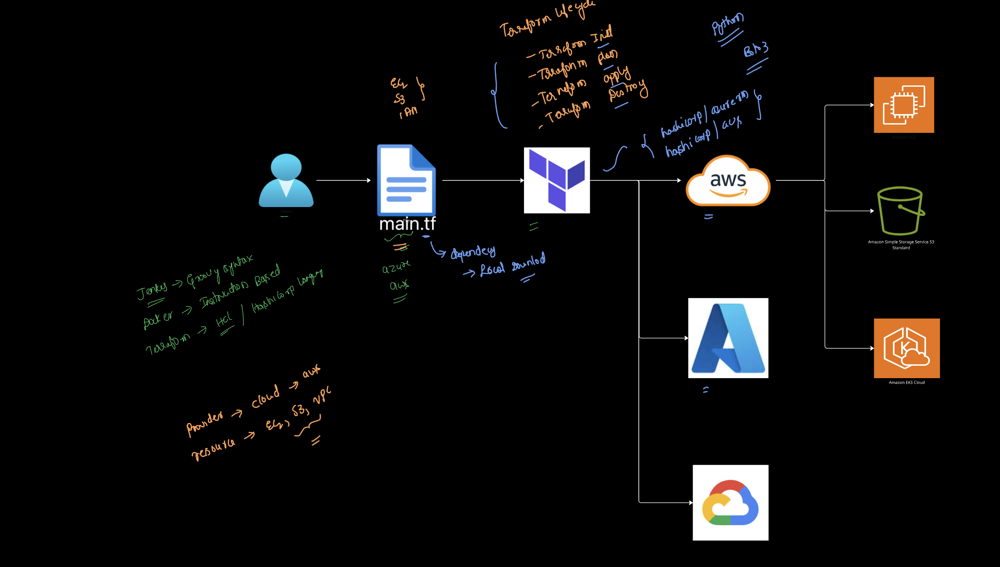

- https://code.visualstudio.com/



## terraform installation
```
#!/bin/bash
sudo apt-get update && sudo apt-get install -y gnupg software-properties-common
wget -O- https://apt.releases.hashicorp.com/gpg | \
gpg --dearmor | \
sudo tee /usr/share/keyrings/hashicorp-archive-keyring.gpg > /dev/null
gpg --no-default-keyring \
--keyring /usr/share/keyrings/hashicorp-archive-keyring.gpg \
--fingerprint
echo "deb [arch=$(dpkg --print-architecture) signed-by=/usr/share/keyrings/hashicorp-archive-keyring.gpg] https://apt.releases.hashicorp.com $(grep -oP '(?<=UBUNTU_CODENAME=).*' /etc/os-release || lsb_release -cs) main" | sudo tee /etc/apt/sources.list.d/hashicorp.list
sudo apt update
sudo apt-get install terraform -y
```

## aws cli installation
```
#!/bin/bash
curl "https://awscli.amazonaws.com/awscli-exe-linux-x86_64.zip" -o "awscliv2.zip"
apt install unzip -y
unzip awscliv2.zip
sudo ./aws/install
```

## Docker Installation
```
#!/bin/bash
sudo apt install docker.io -y
sudo systemctl enable docker
sudo systemctl start  docker
sudo usermod -aG docker ubuntu
sudo usermod -aG docker jenkins
```

```
#!/bin/bash
sudo apt update
sudo apt install fontconfig openjdk-21-jre -y
sudo wget -O /etc/apt/keyrings/jenkins-keyring.asc \
  https://pkg.jenkins.io/debian-stable/jenkins.io-2023.key
echo "deb [signed-by=/etc/apt/keyrings/jenkins-keyring.asc]" \
  https://pkg.jenkins.io/debian-stable binary/ | sudo tee \
  /etc/apt/sources.list.d/jenkins.list > /dev/null
sudo apt update
sudo apt install jenkins -y

sudo systemctl enable jenkins
sudo systemctl start jenkins
```